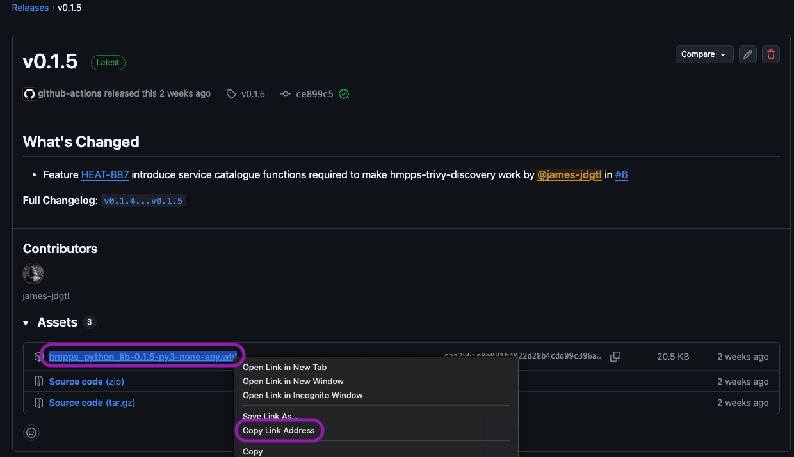

# hmpps-sre-python-lib

A set of python libraries for use in hmpps SRE projects

## Requirements

### Local development
You need to have [uv](https://docs.astral.sh/uv/) installed on your machine to manage Python libraries - it's a very handy tool which takes the pain away from managing `pyproject.toml` files and `.venv` by acting as a wrapper for Python.

```
curl -LsSf https://astral.sh/uv/install.sh | sh
```

or

```
brew install uv
```

Because `uv` creates a virtual environment (`.venv`) when `uv sync` is run, it's possible to activate this environment using

```
source .venv/bin/activate
```
and `python your_script.py` can be used as usual.


## Using hmpps-sre-python-lib in projects

### Github Actions Workflows

Any Github Action or Workflow running python will need the uv installation as well - that's as easy as swapping out the existing `actions/setup-python` section with `

```
  - name: Install uv & set Python
    uses: astral-sh/setup-uv@v6
    with:
      python-version: '3.13'
      enable-cache: true
      cache-dependency-glob: 'uv.lock'   # cache invalidates on lockfile change
```

and then replacing any invocation of `python ...` with `uv run python ...` eg:

```
    run: uv run python scripts/actions_check_sc_requests.py >> "$GITHUB_OUTPUT"
```

### Docker Images

In general, an image like `python:3.13-slim` will be used for existing Python scripts

The most convenient way to support uv within a Docker container is to use the pre-packaged uv image, so:

`ghcr.io/astral-sh/uv:python3.13-alpine` or `ghcr.io/astral-sh/uv:python3.13-bookworm-slim`

If the python application has been developed locally (see [migration](#migrating-to-hmpps-sre-python-lib) below), a `pyproject.toml` file will already exist, in which case it's simply a case of adding these lines to the Dockerfile:

```
COPY pyproject.toml .
RUN uv pip install --user
```

The entrypoint will also need to be updated, from (for example):

```
CMD [ "python", "-u", "github_discovery.py" ]
```

to:
```
CMD [ "uv" "run"  "python", "-u", "github_discovery.py" ]
```

## Cloning this repository

If you're cloning this repository for the first time, you'll need to run

```
uv sync
```
to ensure your local environment matches the requirements of the project. 
In fact, every time you pull down or refresh the project, it's worth running `uv sync` to make sure it's up-to-date with the latest version.


## Updating the library

If you're making changes to the library, here's what needs to happen for it to be available:

### New imported libraries 
These are libraries required by scripts, which would normally be added to `requirements.txt`

```
uv add LIBRARY_NAME==version.number
uv sync
```

This updates uv.lock, so it's ready to be pushed.

### Updating the documentation

If a new function or component is available, please update files within the `docs` folder with the appropriate information.


### Tagging the new version

**Important** The `version` in `pyproject.toml` will be used as the release tag, so it's important to ensure this is updated.

The standard [semver](https://semver.org/) formatting of the version should be used, without a 'v' prefix; this will be added in the Github Release.

### Validating the library on other projects

It's possible to import a version of the library from an active Github branch, so that it can be validated. 

```
uv remove hmpps-sre-python-lib
uv add "hmpps-sre-python-lib @ git+https://github.com/ministryofjustice/hmpps-sre-python-lib.git@feat/HEAT-xxx_your_branch"
uv sync
```

You can then run your script with `uv run python ...` or `source .venv/bin.activate && python ...` and check that it works.

If you want to validate the library on a deployed version, you'll need to add `git` to the installed packages in Dockerfile, eg:
```
# add the necessary libraries
RUN apk add --no-cache gcc python3-dev musl-dev linux-headers git ca-certificates && update-ca-certificates
```

### Raising the PR and tagging the release

Raise a PR once the library is fully validated, and once the PR has been merged, the release will be tagged automatically with the version in `pyproject.toml`.

The library is then built into a [Python Wheel](https://discuss.python.org/t/where-the-name-wheel-comes-from/6708), and saved as a release asset.



### Refreshing the version in other repositories

If a tool is currently using the hmpps-sre-python-lib library, updating is as simple as either editing the pyproject.toml file in the project's root directory:

(taking version 0.1.5 as an example by right-clicking the link in the Release Assets and selecting **Copy Link Address**) 
```
[tool.uv.sources]
hmpps-sre-python-lib = { url = "https://github.com/ministryofjustice/hmpps-sre-python-lib/releases/download/v0.1.5/hmpps_python_lib-0.1.5-py3-none-any.whl" }
```

or you can do:
```
uv remove hmpps-sre-python-lib
uv add https://github.com/ministryofjustice/hmpps-sre-python-lib/releases/download/v0.1.5/hmpps_python_lib-0.1.5-py3-none-any.whl
```


## Migrating to hmpps-sre-python-lib

Migration comes in four parts:

- Initiating the uv project
- Rewriting the scripts so they use the shared library rather than the local imports
- Removing local copies of the imports
- Fine-tuning the pyproject.toml to remove unnecessary packages

### Initiating the uv project

First, a `pyproject.toml` is needed. Run:
```
uv init
```

Then, add the libraries currently mentioned in `requirements.txt` into the project:
```
uv add -r requirements.txt
```

Add the latest version of the `hmpps-sre-python-lib` library. This can be found in in the [releases section of the hmpps-sre-python-lib repository](https://github.com/ministryofjustice/hmpps-sre-python-lib/releases) - right click the corresponding wheel file (eg `hmpps_python_lib-0.0.3-py3-none-any.whl`) and Copy Link Address. 

then run (for example):
```
uv add https://github.com/ministryofjustice/hmpps-sre-python-lib/releases/download/v0.0.3/hmpps_python_lib-0.0.3-py3-none-any.whl
```

Finally, run
```
uv sync
```


### Rewriting scripts

The shared library is imported with the top level `hmpps`. There have been some semantic changes to the names of the subcomponents to better represent their function. See the `docs` folder for the supported classes, models, functions and values for further guidance.

You may find that you get Pylance errors because it can't locate the libraries referred to by the `pyproject.toml` file. This is likely to be because there's already a `.venv` file in place. 

- delete the .venv directory and its contents
- run `uv sync` - this will create a new one
- if necessary, close VSCode and open it up again.

This tends to sort the problem out.

### Removing local copies of the imports

Once the libary is in use, tidy up the local filesystem. It may be that some functions within the same file (eg. utilities.py) need to remain, since they're specific to the particular script that's running. 

If you've got Pylance working correctly, you should be able to delete the local files and quickly identify the bits you might have missed.

### Fine-tuning the pyproject.toml to remove unnecessary packages

Once the hmpps-sre-python-lib library is in use, it may well be that libraries such as `requests`, `slack-sdk` or `pygithub` that may have been picked up and placed within the `pyproject.toml` when are no longer required. To avoid version clases, and errors like this:

```
  × No solution found when resolving dependencies for split (markers: python_full_version >= '3.14' and platform_python_implementation != 'PyPy'):
  ╰─▶ Because only hmpps-sre-python-lib==0.0.1 is available and hmpps-sre-python-lib==0.0.1 depends on requests>=2.32.5, we can conclude that all versions of hmpps-sre-python-lib depend on
      requests>=2.32.5.
      And because your project depends on hmpps-sre-python-lib and requests==2.32.4, we can conclude that your project's requirements are unsatisfiable.

      hint: While the active Python version is 3.13, the resolution failed for other Python versions supported by your project. Consider limiting your project's supported Python versions
      using `requires-python`.
  help: If you want to add the package regardless of the failed resolution, provide the `--frozen` flag to skip locking and syncing.
```

...removing unnecessary dependencies is essential. It may, in fact, be that you don't need any additional dependencies, but others (for example dockerfile_parse) may  be specific for your project. Here, for example, is hmpps-github-discovery's pyrpoject.yaml:

```
[project]
name = "hmpps-github-discovery"
version = "0.1.0"
description = "Add your description here"
readme = "README.md"
requires-python = ">=3.13"
dependencies = [
    "dockerfile-parse==2.0.1",
    "hmpps-sre-python-lib"
]

[tool.uv.sources]
hmpps-sre-python-lib = { url = "https://github.com/ministryofjustice/hmpps-sre-python-lib/releases/download/v0.0.2/hmpps_python_lib-0.0.2-py3-none-any.whl" }
```
