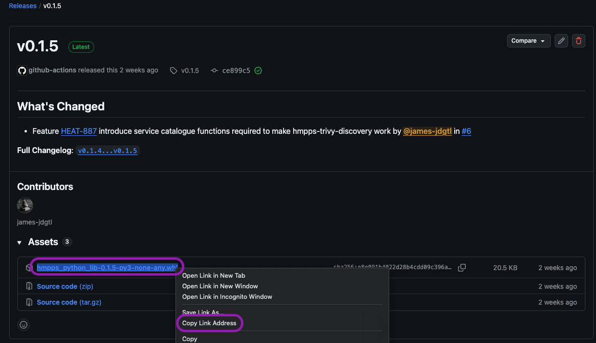

# hmpps-sre-python-lib

A set of shared Python libraries for use in HMPPS SRE projects.

## Overview
This library provides common clients and models for interacting with HMPPS infrastructure, including GitHub, Slack, SharePoint, and the Service Catalogue.

## Getting Started

### Prerequisites
You need to have [uv](https://docs.astral.sh/uv/) installed to manage Python libraries and environments.

```bash
# macOS (Homebrew)
brew install uv

# Other platforms
curl -LsSf https://astral.sh/uv/install.sh | sh
```

### Local Development
1.  **Clone the repository**:
    ```bash
    git clone https://github.com/ministryofjustice/hmpps-sre-python-lib.git
    cd hmpps-sre-python-lib
    ```
2.  **Initialize the environment**:
    ```bash
    uv sync
    ```
    This creates a virtual environment (`.venv`) and installs all dependencies from `uv.lock`.
3.  **Activate the environment**:
    ```bash
    source .venv/bin/activate
    ```
    Now you can run scripts or tests using `python` as usual, or use `uv run python your_script.py`.

## Using this library in your project

### 1. Adding the dependency
To add this library to a project using `uv`, use the URL of the latest release wheel. You can find these in the [Releases section](https://github.com/ministryofjustice/hmpps-sre-python-lib/releases).

```bash
uv add https://github.com/ministryofjustice/hmpps-sre-python-lib/releases/download/v1.2.9/hmpps_python_lib-1.2.9-py3-none-any.whl
```

Alternatively, edit your `pyproject.toml`:
```toml
dependencies = [
    "hmpps-sre-python-lib"
]

[tool.uv.sources]
hmpps-sre-python-lib = { url = "https://github.com/ministryofjustice/hmpps-sre-python-lib/releases/download/v1.2.9/hmpps_python_lib-1.2.9-py3-none-any.whl" }
```

### 2. Usage in GitHub Actions
Swap out `actions/setup-python` for `astral-sh/setup-uv`:

```yaml
- name: Install uv & set Python
  uses: astral-sh/setup-uv@v6
  with:
    python-version: '3.13'
    enable-cache: true
    cache-dependency-glob: 'uv.lock'

- name: Run script
  run: uv run python scripts/my_script.py
```

### 3. Usage in Docker
For HMPPS Python projects, you can use the MOJ standard images or the official `uv` image.

**Standard Images:**
- `ghcr.io/ministryofjustice/hmpps-python:python3.13-alpine`
- `ghcr.io/astral-sh/uv:python3.13-bookworm-slim`

To support `uv` in your Dockerfile:

```dockerfile
COPY pyproject.toml uv.lock ./
# If using a non-uv image, you'll need to install uv first
RUN uv sync --frozen
# Example entrypoint
CMD [ "uv", "run", "python", "-u", "my_script.py" ]
```

## Contributing

### Making Changes
1.  **Add dependencies**: Use `uv add <library>` to update `pyproject.toml` and `uv.lock`.
2.  **Documentation**: Update relevant files in the `docs/` folder if you add new features.
3.  **Formatting**: This project uses `ruff`. You can install Husky to enable pre-commit hooks:
    ```bash
    npm install husky --save-dev
    ```
4.  **Validation**: Test your changes in another project before merging. You can point `uv` directly at your branch:
    ```bash
    uv remove hmpps-sre-python-lib
    uv add "hmpps-sre-python-lib @ git+https://github.com/ministryofjustice/hmpps-sre-python-lib.git@your-branch-name"
    uv sync
    ```

    *Note: If validating on a deployed Docker container, you may need to ensure `git` is installed (e.g., `RUN apk add --no-cache git`).*

### Releasing a new version
This repository uses automated releases via GitHub Actions.

1.  **Update the version** in `pyproject.toml` (following [SemVer](https://semver.org/)).
2.  **Update `CHANGELOG.md`** with your changes.
3.  **Sync the lockfile**: Run `uv lock`.
4.  **Commit and push** to your branch.
5.  **Merge the Pull Request** into `main`.

Once merged, the release workflow will automatically:
- Create a Git tag (e.g., `v1.2.9`).
- Create a GitHub Release.
- Build and upload the Python wheel asset.



## Maintenance

### Patching Vulnerabilities
If Dependabot alerts you to a vulnerability, or you need to refresh dependencies:

```bash
# Refresh a specific library
uv lock -P werkzeug
# Refresh all libraries
uv lock -U
# Sync environment
uv sync
```

---

## Migration Guide
If you are moving an existing project to use `hmpps-sre-python-lib`:

1.  **Initialize uv**: `uv init`
2.  **Import requirements**: `uv add -r requirements.txt`
3.  **Add this library**: Find the latest wheel in [Releases](https://github.com/ministryofjustice/hmpps-sre-python-lib/releases) and run:
    ```bash
    uv add <release-url-to-wheel>
    ```
4.  **Rewrite & Clean up**: Update your imports to use the shared library and remove local copies of those files.
5.  **Qualify Imports**: The library is imported via `hmpps`. Example: `from hmpps.clients.github import GithubSession`.
6.  **Fine-tuning Dependencies**: Remove unnecessary packages from `pyproject.toml` (like `requests` or `slack-sdk`) if they are already provided by this library. This avoids version clashes like:
    ```text
    × No solution found when resolving dependencies:
    ╰─▶ Because your project depends on hmpps-sre-python-lib and requests==2.32.4, 
        and hmpps-sre-python-lib depends on requests>=2.32.5, resolution failed.
    ```
7.  **Troubleshooting Pylance**: If Pylance can't locate libraries despite `uv sync`:
    - Delete the `.venv` directory.
    - Run `uv sync` to recreate it.
    - Restart VS Code if necessary.
